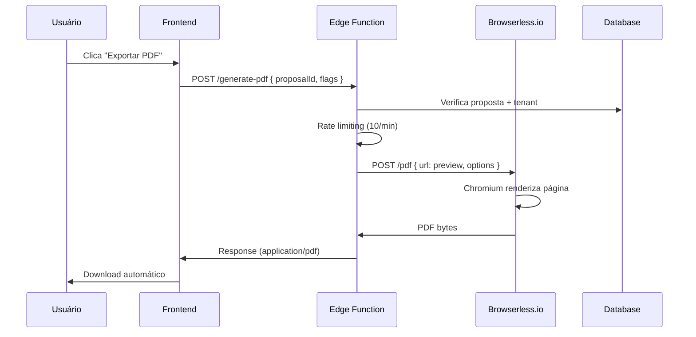
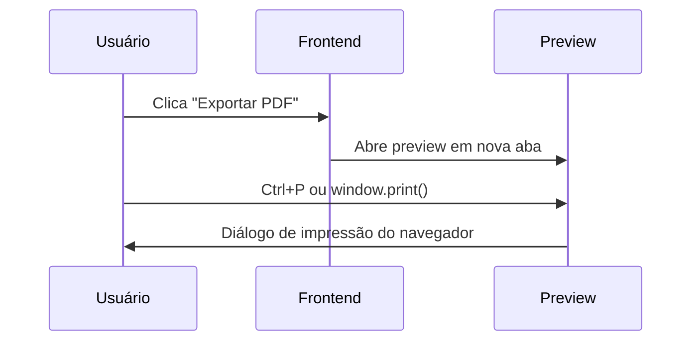

# Geração de PDF - Guia de Implementação

## Status Atual (Fase 2)

✅ **Implementado:**
- Edge Function `/generate-pdf` com auth e rate limiting
- Verificação de tenant ownership
- Fallback para `window.print()` no preview
- Rate limiting: 10 PDFs/min por organização
- Sanitização e validação de entrada

⚠️ **Limitação Atual:**
- Puppeteer **não funciona** em Deno Deploy (runtime Supabase Edge Functions)
- Solução temporária: usuário gera PDF via `window.print()` no navegador
- Edge Function retorna URL do preview para impressão manual

## Soluções para Puppeteer

### Opção 1: Browserless.io (Recomendado) ⭐

**Prós:**
- Puppeteer as a Service totalmente gerenciado
- Escala automaticamente
- Suporta filas e webhooks
- API simples

**Contras:**
- Custo adicional ($99/mês para 1000 PDFs)

**Implementação:**

1. **Criar conta no Browserless.io:**
   - https://www.browserless.io/
   - Obter token de API

2. **Adicionar secret no Supabase:**
```bash
# Via Lovable Cloud UI ou CLI
BROWSERLESS_TOKEN=seu_token_aqui
```

3. **Descomentar código na Edge Function:**
```typescript
// supabase/functions/generate-pdf/index.ts
const browserlessToken = Deno.env.get('BROWSERLESS_TOKEN');

const response = await fetch(`https://chrome.browserless.io/pdf?token=${browserlessToken}`, {
  method: 'POST',
  headers: { 'Content-Type': 'application/json' },
  body: JSON.stringify({
    url: previewUrl,
    options: {
      format: 'A4',
      margin: { top: '18mm', right: '18mm', bottom: '18mm', left: '18mm' },
      printBackground: true,
      preferCSSPageSize: true,
    },
  }),
});

const pdfBytes = await response.arrayBuffer();
return new Response(pdfBytes, {
  headers: {
    'Content-Type': 'application/pdf',
    'Content-Disposition': `attachment; filename="proposta-${proposalId}.pdf"`,
  },
});
```

4. **Atualizar frontend:**
```typescript
// src/pages/preview/ProposalPreview.tsx
import { generateProposalPdf } from '@/lib/pdf';

const handleExportPdf = async () => {
  const result = await generateProposalPdf({ 
    proposalId: proposalId!, 
    flags: { showDetails } 
  });
  
  if (result.success && result.pdfUrl) {
    window.open(result.pdfUrl, '_blank');
  }
};
```

---

### Opção 2: Servidor Node.js Separado

**Prós:**
- Controle total sobre Puppeteer
- Sem custos de terceiros

**Contras:**
- Requer infraestrutura adicional
- Manutenção de servidor
- Complexidade de deploy

**Implementação:**

1. **Criar servidor Node.js:**
```javascript
// server.js
const express = require('express');
const puppeteer = require('puppeteer');

const app = express();
app.use(express.json());

app.post('/generate-pdf', async (req, res) => {
  const { url } = req.body;
  
  const browser = await puppeteer.launch({ 
    headless: true,
    args: ['--no-sandbox'] 
  });
  
  const page = await browser.newPage();
  await page.goto(url, { waitUntil: 'networkidle0' });
  
  const pdf = await page.pdf({
    format: 'A4',
    margin: { top: '18mm', right: '18mm', bottom: '18mm', left: '18mm' },
    printBackground: true,
  });
  
  await browser.close();
  
  res.contentType('application/pdf');
  res.send(pdf);
});

app.listen(3001);
```

2. **Deploy em Railway, Render ou DigitalOcean**

3. **Chamar do Edge Function:**
```typescript
const response = await fetch('https://seu-servidor.com/generate-pdf', {
  method: 'POST',
  headers: { 'Content-Type': 'application/json' },
  body: JSON.stringify({ url: previewUrl }),
});
```

---

### Opção 3: jsPDF no Frontend (Fallback)

**Prós:**
- Sem backend adicional
- Gratuito

**Contras:**
- Layout menos fiel ao CSS
- Requer reconstrução do template em jsPDF
- Manutenção duplicada

**Não recomendado** - a renderização com CSS é superior.

---

## Fluxo Completo (Com Puppeteer)



## Configuração Atual (Sem Puppeteer)



## Rate Limiting

**Implementado em memória** (por instância de Edge Function):
- 10 PDFs por minuto por organização
- Reset automático após 60 segundos
- Erro 429 quando limite excedido

**Produção**: considerar usar Redis ou Upstash para rate limiting compartilhado entre instâncias.

## Segurança

✅ **Implementado:**
- Auth JWT obrigatório
- Verificação de tenant ownership
- Rate limiting
- Validação de entrada
- Logs de geração

## Custos Estimados

### Browserless.io
- **Hobby**: $99/mês - 1.000 PDFs
- **Pro**: $299/mês - 5.000 PDFs
- **Business**: $499/mês - 10.000 PDFs

### Servidor Node.js (Railway)
- **Hobby**: $5/mês - 500h compute
- **Pro**: $20/mês - uso ilimitado

### Supabase Edge Functions
- Gratuito até 500k requests/mês
- $2 por 1M requests adicionais

## Próximos Passos

1. **Decidir solução de Puppeteer** (Browserless.io vs servidor próprio)
2. **Configurar BROWSERLESS_TOKEN** ou endpoint do servidor
3. **Descomentar código de geração** na Edge Function
4. **Testar com propostas reais**
5. **Implementar cache de PDFs** (opcional - usar Supabase Storage)

## Cache (Opcional)

Para reduzir custos, considerar cachear PDFs gerados:

```typescript
// Verificar se PDF já existe no Storage
const { data: cached } = await supabase.storage
  .from('generated-pdfs')
  .download(`${proposalId}-v${proposal.version}.pdf`);

if (cached) {
  return new Response(cached, {
    headers: { 'Content-Type': 'application/pdf' }
  });
}

// Gerar novo PDF...
// Salvar no Storage para próxima vez
await supabase.storage
  .from('generated-pdfs')
  .upload(`${proposalId}-v${proposal.version}.pdf`, pdfBytes);
```

## Referências

- **Browserless.io**: https://www.browserless.io/docs/
- **Puppeteer**: https://pptr.dev/
- **Supabase Edge Functions**: https://supabase.com/docs/guides/functions
- **Print CSS**: https://www.smashingmagazine.com/2015/01/designing-for-print-with-css/
