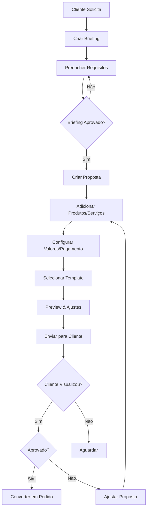

# 📋 Sistema de Propostas e Briefing v2.0

> Documentação completa do novo sistema de propostas comerciais com briefing integrado

---

## 🎯 Visão Geral

Sistema modernizado de gestão de propostas comerciais com foco em:
- **Briefing estruturado**: Captura de requisitos antes da proposta
- **Workflow otimizado**: Etapas claras do briefing à aprovação
- **Integração total**: Produtos, clientes, templates v2
- **Rastreabilidade**: Histórico completo de interações

---

## 📊 Arquitetura de Dados

### Tabela: `briefings`

```sql
CREATE TABLE briefings (
  id UUID PRIMARY KEY DEFAULT gen_random_uuid(),
  organization_id UUID NOT NULL REFERENCES organizations(id),
  client_id UUID NOT NULL REFERENCES clients(id),
  created_by UUID NOT NULL REFERENCES profiles(user_id),
  created_at TIMESTAMPTZ DEFAULT now(),
  updated_at TIMESTAMPTZ DEFAULT now(),
  
  -- Dados básicos
  title TEXT NOT NULL,
  description TEXT,
  project_type TEXT, -- Ex: "Reforma", "Construção", "Decoração"
  budget_range TEXT, -- Ex: "até 50k", "50k-100k", "100k+"
  deadline DATE,
  
  -- Requisitos estruturados
  requirements JSONB DEFAULT '{}', -- Campos customizáveis
  attachments TEXT[], -- URLs de arquivos
  
  -- Status
  status TEXT DEFAULT 'draft', -- draft, sent, reviewing, approved, rejected
  
  -- Metadados
  notes TEXT,
  tags TEXT[]
);
```

### Tabela: `proposals_v2`

```sql
CREATE TABLE proposals_v2 (
  id UUID PRIMARY KEY DEFAULT gen_random_uuid(),
  organization_id UUID NOT NULL REFERENCES organizations(id),
  briefing_id UUID REFERENCES briefings(id),
  client_id UUID NOT NULL REFERENCES clients(id),
  created_by UUID NOT NULL REFERENCES profiles(user_id),
  created_at TIMESTAMPTZ DEFAULT now(),
  updated_at TIMESTAMPTZ DEFAULT now(),
  
  -- Dados da proposta
  number TEXT UNIQUE NOT NULL, -- Ex: "PROP-2025-001"
  title TEXT NOT NULL,
  description TEXT,
  validity_days INTEGER DEFAULT 30,
  valid_until DATE,
  
  -- Produtos/Serviços
  items JSONB DEFAULT '[]', -- Array de items com produto_id, qty, price, etc
  
  -- Valores
  subtotal NUMERIC(12,2) DEFAULT 0,
  discount_amount NUMERIC(12,2) DEFAULT 0,
  discount_percentage NUMERIC(5,2) DEFAULT 0,
  total NUMERIC(12,2) NOT NULL DEFAULT 0,
  
  -- Pagamento
  payment_method_id UUID REFERENCES payment_methods(id),
  installments INTEGER DEFAULT 1,
  down_payment NUMERIC(12,2) DEFAULT 0,
  
  -- Template
  template_id UUID REFERENCES proposal_templates_v2(id),
  custom_data JSONB DEFAULT '{}', -- Override de dados do template
  
  -- Status e workflow
  status TEXT DEFAULT 'draft', 
  -- draft, sent, viewed, approved, rejected, expired, converted
  
  -- Aprovação do cliente
  client_approved_at TIMESTAMPTZ,
  client_rejection_reason TEXT,
  client_signature TEXT, -- Base64 da assinatura
  
  -- Metadados
  notes TEXT,
  internal_notes TEXT, -- Visível só para equipe
  tags TEXT[]
);
```

### Tabela: `proposal_interactions`

```sql
CREATE TABLE proposal_interactions (
  id UUID PRIMARY KEY DEFAULT gen_random_uuid(),
  proposal_id UUID NOT NULL REFERENCES proposals_v2(id) ON DELETE CASCADE,
  created_at TIMESTAMPTZ DEFAULT now(),
  
  type TEXT NOT NULL, -- viewed, downloaded, shared, commented, status_changed
  user_id UUID REFERENCES profiles(user_id),
  
  metadata JSONB DEFAULT '{}', -- Dados específicos do tipo de interação
  description TEXT
);
```

---

## 🔄 Fluxo de Trabalho



---

## 🎨 Interface (MVP)

### 1. Página de Briefings (`/briefings`)

**Listagem**:
- Cards com: cliente, título, status, data, tags
- Filtros: status, cliente, data, vendedor
- Ações: novo briefing, editar, converter em proposta

**Formulário de Briefing**:
```typescript
interface BriefingForm {
  client_id: string;
  title: string;
  description?: string;
  project_type?: string;
  budget_range?: string;
  deadline?: Date;
  requirements: {
    // Campos dinâmicos customizáveis
    ambiente?: string;
    metragem?: number;
    estilo?: string[];
    preferencias?: string;
  };
  attachments?: File[];
  notes?: string;
  tags?: string[];
}
```

### 2. Página de Propostas v2 (`/propostas-v2`)

**Listagem**:
- Tabela com: número, cliente, valor, status, validade, ações
- Indicadores visuais de status
- Badges de urgência (próximo do vencimento)

**Editor de Proposta** (`/propostas-v2/editor/:id`):

Layout em 3 colunas:

```
┌────────────────────────────────────────┐
│         HEADER (Cliente, Número)       │
├─────────────┬───────────┬──────────────┤
│   PRODUTOS  │  CANVAS   │   PAINEL     │
│   (esq)     │  CENTRAL  │   (dir)      │
│             │           │              │
│ • Buscar    │ • Preview │ • Dados      │
│ • Tabela    │ • Template│ • Valores    │
│ • Qtd/Preço │ • Editar  │ • Pagamento  │
│ • Descontos │           │ • Envio      │
└─────────────┴───────────┴──────────────┘
```

---

## 🔐 Permissões (RLS)

```sql
-- Briefings: usuários veem da própria org
CREATE POLICY "briefings_org_policy" ON briefings
  FOR ALL USING (
    organization_id IN (
      SELECT organization_id FROM profiles WHERE user_id = auth.uid()
    )
  );

-- Propostas v2: usuários veem da própria org
CREATE POLICY "proposals_v2_org_policy" ON proposals_v2
  FOR ALL USING (
    organization_id IN (
      SELECT organization_id FROM profiles WHERE user_id = auth.uid()
    )
  );

-- Vendedores veem apenas suas próprias
CREATE POLICY "proposals_v2_seller_policy" ON proposals_v2
  FOR SELECT USING (
    is_seller(auth.uid()) AND created_by = auth.uid()
  );

-- Gerentes e admins veem todas da org
CREATE POLICY "proposals_v2_manager_policy" ON proposals_v2
  FOR ALL USING (
    can_manage_proposals(auth.uid())
  );
```

---

## 📱 Features Principais

### Briefing
- [x] CRUD completo
- [x] Campos customizáveis (JSONB)
- [x] Upload de anexos
- [x] Conversão para proposta
- [x] Histórico de alterações
- [ ] Templates de briefing por segmento

### Proposta
- [x] Numeração automática sequencial
- [x] Vinculação com briefing
- [x] Seleção de produtos com busca
- [x] Cálculo automático de totais
- [x] Descontos flexíveis (% ou valor)
- [x] Parcelamento configurável
- [x] Template v2 integrado
- [x] Preview em tempo real
- [x] Envio por email
- [ ] Assinatura digital do cliente
- [ ] Link público com senha
- [ ] Notificações de visualização

### Rastreamento
- [x] Log de todas as interações
- [x] Visualizações rastreadas
- [x] Downloads contabilizados
- [x] Histórico de status
- [ ] Analytics de conversão

---

## 🚀 Roadmap de Implementação

### Fase 1: Estrutura Base (Esta etapa)
- [x] Migrations de banco
- [x] Modelos TypeScript
- [x] RLS policies
- [ ] Queries básicas
- [ ] UI de listagem

### Fase 2: Editor de Proposta
- [ ] Layout 3 colunas
- [ ] Busca e seleção de produtos
- [ ] Cálculos em tempo real
- [ ] Integração com templates v2
- [ ] Preview vivo

### Fase 3: Briefing
- [ ] Formulário de captura
- [ ] Campos dinâmicos
- [ ] Conversão briefing → proposta
- [ ] Templates de briefing

### Fase 4: Envio e Aprovação
- [ ] Geração de link público
- [ ] Email com link
- [ ] Página de aprovação do cliente
- [ ] Assinatura digital
- [ ] Webhook de status

---

## 📊 Métricas de Sucesso

- **Tempo médio de criação**: < 3 minutos
- **Taxa de conversão**: > 45%
- **Propostas enviadas/mês**: crescimento 25%
- **Satisfação cliente (NPS)**: > 60

---

**Última atualização**: Janeiro 2025  
**Próxima revisão**: Fevereiro 2025
